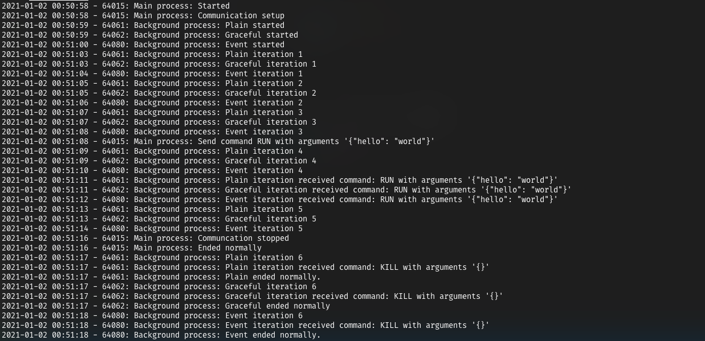

# Background processes in python

Running python background processes using `Popen` from the `subprocess` module, establish file-based communication in both directions and exit gracefully on Unix-like operating systems.

Execute `./run.sh`, which starts the main process and monitors log and processes.
Then you can kill the background process manually (`kill <pid>`) and observe behaviour or wait until the main process stops the communication and thereby triggers the exit of the background process.

**Note:** Exiting `run.sh` by hitting `ctrl+c` will only end the `background_gracful.py` and `background_event.py` processes while `background_plain.py` keeps running.

## Main process

1. Sets up a file-based communication.
2. Starts the background process using `Popen` from the `subprocess` module.
3. Sends a dummy command `EXECUTE` with arguments to the background process and waits for response of the background process.
4. Exits and closes communication, which triggers the `KILL` command in the background process.

## Background process

Process writes to log, listens to the file-based communication and handles exit differently:

* 0 `background_plain.py`: Nothing done on exit.
* 1 `background_gracful.py`: Execute cleanup at the end of the iteration, delay.
* 2 `background_event.py`: Execute cleanup immediately when killed (default).

The background process type can be chosen in the `main.py` file.

## Licenses

This project is licensed under the MIT License - see the [LICENSE](LICENSE) file for details

## References

* [GracefulKiller class](https://stackoverflow.com/questions/18499497/how-to-process-sigterm-signal-gracefully)
* [Event](https://stackoverflow.com/questions/5114292/break-interrupt-a-time-sleep-in-python/46346184#46346184)
